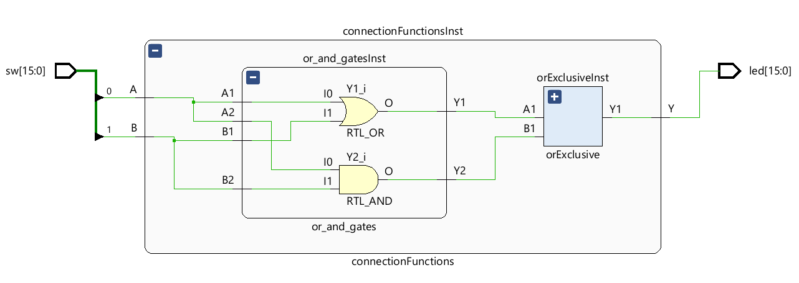

# **EJEMPLO DE CONEXIÓN DE DISTINTOS COMPONENTES EN VHDL**

El presente documento requiere un ejemplo simple donde se explica cómo conectar dos componentes/circuitos desarrollados en VHDL entre si. El ejemplo descrito es un ejemplo simple que pretende ser meramente ilustrativo, explicando como realizar la conexión de dos componentes descritos de manera independiente en ficheros distintos.

La siguiente descripción contiene la descripción de un componente contiene dos puertas lógicas, una ***and*** y una ***or*** de dos entradas independientes para cada una. La figura que describe el compornente es . 

El código que describe este componente se muestra a continuación:

```VHDL
library IEEE;
use IEEE.STD_LOGIC_1164.ALL;

entity or_and_gates is
    Port ( A1 : in STD_LOGIC;
           B1 : in STD_LOGIC;
           Y1 : out STD_LOGIC;
           A2 : in STD_LOGIC;
           B2 : in STD_LOGIC;
           Y2 : out STD_LOGIC);
end or_and_gates;

architecture Behavioral of or_and_gates is

begin

    Y1<= A1 or B1;
    Y2<= A2 and B2;

end Behavioral;
```

Tal y como debe realizarse siempre en el desarrollo de sistemas complejos se describe a continuación el código del banco de pruebas que permite validar el comporamiento del circuito anteriormente descrito. Este circuito es muy sencillo y esta validación no sería necesaria, pero como hábito de diseño es interesante realizarlo. 

El código de test bench es el siguiente:

```VHDL
library IEEE;
use IEEE.STD_LOGIC_1164.ALL;

entity or_and_gates_tb is
--  Port ( );
end or_and_gates_tb;

architecture Behavioral of or_and_gates_tb is

component or_and_gates is
 Port (    A1 : in STD_LOGIC;
           B1 : in STD_LOGIC;
           Y1 : out STD_LOGIC;
           A2 : in STD_LOGIC;
           B2 : in STD_LOGIC;
           Y2 : out STD_LOGIC);
end component;

--signals 
signal  A1s : STD_LOGIC;
signal  B1s : STD_LOGIC;
signal  Y1s : STD_LOGIC;
signal  A2s : STD_LOGIC;
signal  B2s : STD_LOGIC;
signal  Y2s : STD_LOGIC;

begin

or_and_gatesInts : or_and_gates
    port map(
    A1 => A1s,
    B1 => B1s,
    Y1 => Y1s,
    A2 => A2s,
    B2 => B2s,
    Y2 => Y2s);

process
    begin
        A1s <= '0';
        B1s <= '0';

        A2s <= '0';
        B2s <= '0';
        wait for 10 ns;
        A1s <= '1';
        B1s <= '0';

        A2s <= '0';
        B2s <= '1';
        wait for 10 ns;
        A1s <= '1';
        B1s <= '1';

        A2s <= '1';
        B2s <= '1';
        wait for 50 ns;

end process;

end Behavioral;

```

El siguiente componente que va a formar muestro sistema es una puerta or exclusiva como la presentada en la Figura: 


Su funcionamiento se describe en el siguiente código:
```VHDL
library IEEE;
use IEEE.STD_LOGIC_1164.ALL;

entity orExclusive is
    Port ( A1 : in STD_LOGIC;
        B1 : in STD_LOGIC;
        Y1 : out STD_LOGIC
    );
end orExclusive;

architecture Behavioral of orExclusive is

begin

    Y1<= (A1 and not (B1)) or (not (A1) and B1);    

end Behavioral;
```

Nuevamente, aunque el componente es sencillo realizamos la comprobación del mismo mediante simulación con el un código muy similar al del caso anterior. El código es este:

```VHDL
library IEEE;
use IEEE.STD_LOGIC_1164.ALL;

entity orExclusive_tb is
--  Port ( );
end orExclusive_tb;

architecture Behavioral of orExclusive_tb is

component orExclusive is
 Port (    A1 : in STD_LOGIC;
           B1 : in STD_LOGIC;
           Y1 : out STD_LOGIC);
end component;

--signals 
signal  A1s : STD_LOGIC;
signal  B1s : STD_LOGIC;
signal  Y1s : STD_LOGIC;

begin

orExclusive_Ints : orExclusive
    port map(
    A1 => A1s,
    B1 => B1s,
    Y1 => Y1s);

process
    begin
        A1s <= '0';
        B1s <= '0';
        wait for 10 ns;
        A1s <= '1';
        B1s <= '0';
        wait for 10 ns;
        A1s <= '1';
        B1s <= '1';
        wait for 50 ns;
end process;

end Behavioral;
```

Estos dos componentes se van conectar conforme al siguiente esquema: 

La unicón es estos componentes tal y como se describe en el siguinte código:
```VHDL
library IEEE;
use IEEE.STD_LOGIC_1164.ALL;

entity connectionFunctions is
    Port (  A : in STD_LOGIC;
        B : in STD_LOGIC;
        Y : out STD_LOGIC
    );
end connectionFunctions;

architecture Behavioral of connectionFunctions is
    
    component orExclusive is
        Port (    A1 : in STD_LOGIC;
            B1 : in STD_LOGIC;
            Y1 : out STD_LOGIC);
    end component;
    
    COMPONENT or_and_gates IS
        port (
            A1 : in STD_LOGIC;
            B1 : in STD_LOGIC;
            Y1 : out STD_LOGIC;
            A2 : in STD_LOGIC;
            B2 : in STD_LOGIC;
            Y2 : out STD_LOGIC
        );
    end component or_and_gates;
    
    signal out1int : STD_LOGIC;
    signal out2int : STD_LOGIC;

begin
    orExclusiveInst : orExclusive
    port map(
        A1 => out1int,
        B1 => out2int,
        Y1 => Y
    );
    
    or_and_gatesInst : or_and_gates
    port map(
        A1 => A,
        B1 => B,
        Y1 => out1int,
        A2 => A,
        B2 => B,
        Y2 => out2int);

end Behavioral;

```

La siguiente Figura muestra la captura en vivado, ya conectado a las entradas salidas tal y como vienen definidas en la PCB Boolean Board.


El test bench que permite validar el funcionamiento del circuito es este:
```VHDL
library IEEE;
use IEEE.STD_LOGIC_1164.ALL;

entity or_and_gates_tb is
--  Port ( );
end or_and_gates_tb;

architecture Behavioral of or_and_gates_tb is

component or_and_gates is
 Port (    A1 : in STD_LOGIC;
           B1 : in STD_LOGIC;
           Y1 : out STD_LOGIC;
           A2 : in STD_LOGIC;
           B2 : in STD_LOGIC;
           Y2 : out STD_LOGIC);
end component;

--signals 
signal  A1s : STD_LOGIC;
signal  B1s : STD_LOGIC;
signal  Y1s : STD_LOGIC;
signal  A2s : STD_LOGIC;
signal  B2s : STD_LOGIC;
signal  Y2s : STD_LOGIC;

begin
    or_and_gatesInts : or_and_gates
        port map(
        A1 => A1s,
        B1 => B1s,
        Y1 => Y1s,
        A2 => A2s,
        B2 => B2s,
        Y2 => Y2s);

    process
        begin
            A1s <= '0';
            B1s <= '0';
            A2s <= '0';
            B2s <= '0';
            wait for 10 ns;
            A1s <= '1';
            B1s <= '0';
            A2s <= '0';
            B2s <= '1';
            wait for 10 ns;
            A1s <= '1';
            B1s <= '1';
            A2s <= '1';
            B2s <= '1';
            wait for 50 ns;
    end process;

end Behavioral;
```

Para terminar el proyecto y vericar el funcionamiento es necesario establecer el nombre del archivo boolen.xdc, es decir, la definición de sus entradas salidas con nuestro componente, para ello se ha desarrollado el siguiente código que realiza esta coenxión:
```VHDL
library IEEE;
use IEEE.STD_LOGIC_1164.ALL;

entity top_hard is
    Port ( sw : in STD_LOGIC_VECTOR (15 downto 0);
           led : out STD_LOGIC_VECTOR (15 downto 0));
end top_hard;

architecture Behavioral of top_hard is
    component connectionFunctions is
        Port (  A : in STD_LOGIC;
                B : in STD_LOGIC;
                Y : out STD_LOGIC);
    end component;

    signal As, Bs, Ys: STD_LOGIC;

begin
    connectionFunctionsInst: connectionFunctions
    port map(
        A => As,
        B => Bs,
        Y => Ys
    );

    As <= sw(0);
    Bs <= sw(1);
    led(0) <= Ys;

end Behavioral;
```
Nuevamente sería necesario realizar la simulación con las entradas salidas del hardware físico aquí implementadas y habiendolas tenido en cuenta en el desarrollo para poder verificar el funcionamiento final antes de la programación del sistema. El ddesarrollo de este test bcch se deja al lector para que mejore su práctica y comprensión.